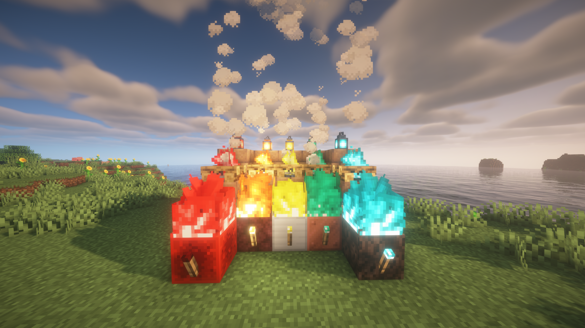

# So Let's Set The Ore On Fire

So Let's Set The Ore On Fire (name being a reference to the song "We Are Young" by Fun) is an attempt to be a vanilla-friendly mod that adds different fires depending on the material.

In real life, there are flame tests which suggest what elements could look like when on fire.

Currently, the mod adds fire, and its respective torches, lanterns and campfires for Redstone (red), Iron (gold/yellow), and Copper (blue-green).

Possibly in the future more materials can be added for other fire, in real life some things like Lapis lazuli/Lazulite would crack under fire, but maybe an exception could be made

# Contributing
Feel free to open a pull request!

# License
The template of this repository was originally made from the Quilt Mod Template, licensed under CC 1.0 Universal. A lot of the other build files are from the Architectury template. This mod is licensed under GNU GPL v3.0.
